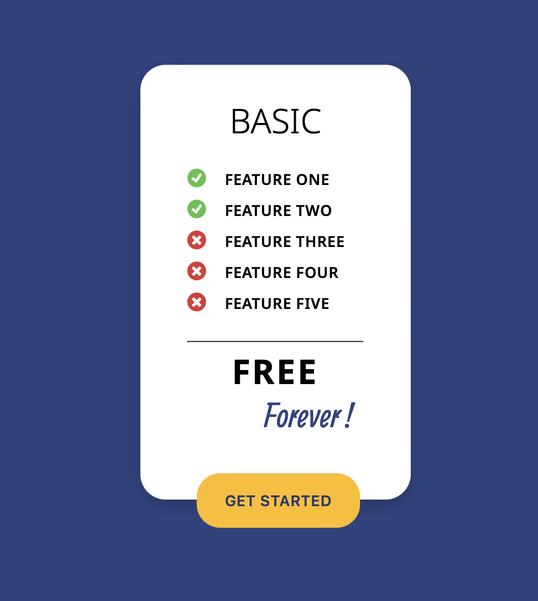

# Figma Project  |  Pixel Perfect

## Description  
This project is a pixel-perfect recreation of an application based on a Figma design. It demonstrates the use of **HTML** and **CSS** to replicate a modern UI while ensuring precise alignment, spacing, and styling.

---

## Features  
- create button
- import font  
- import image  
- use flex   

---

## Preview  
Here’s a preview of the To-Do List interface:  

  

---

## Technologies Used  
- **HTML5** for semantic structure.  
- **CSS3** for layout and styling.  
- **Figma** for design reference.

---

## Design Reference  
The design for this project was based on the following Figma file:  
[Click here to view the Figma design](https://www.figma.com/design/vZ4JwyonFDZ4cZXM1fnyNP/EXERCISE2?node-id=1-18)  

--
## The final result :  
You can view it here:  
[Click here to visit my "website"](https://littlefoxy1nk.github.io/figma-project-2/)

